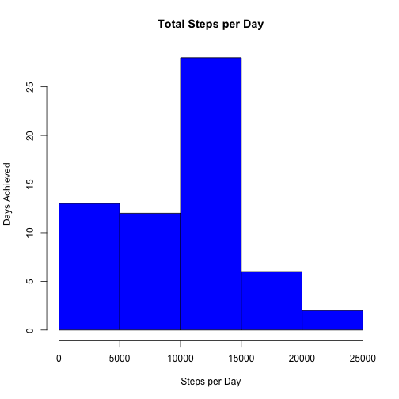
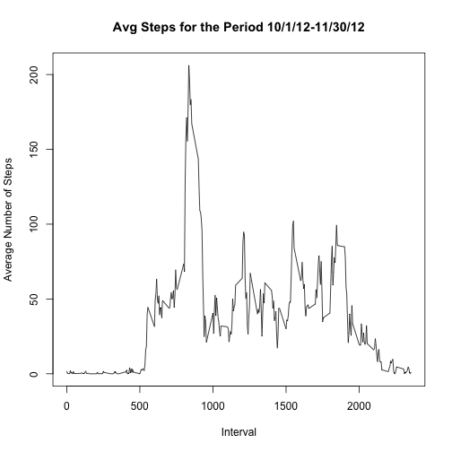
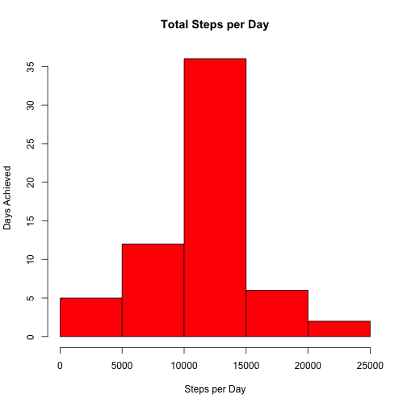
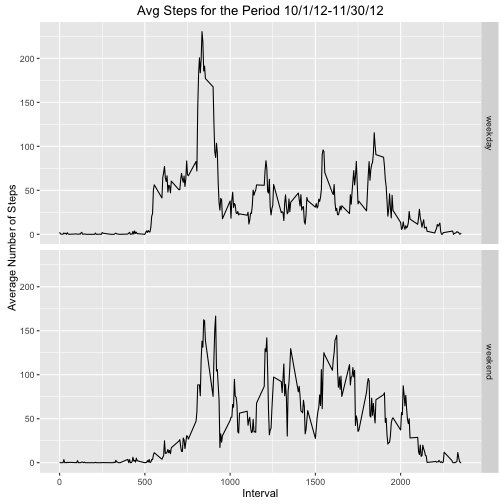

---

title: "PA1_template.Rmd"
author: "Melanie Emmel"
date: "August 9, 2016"
output: html_document
---


# REPRODUCIBLE RESEARCH PROJECT

It is now possible to collect a large amount of data about personal movement using activity monitoring devices such as a Fitbit, Nike Fuelband, or Jawbone Up. These type of devices are part of the “quantified self” movement – a group of enthusiasts who take measurements about themselves regularly to improve their health, to find patterns in their behavior, or because they are tech geeks. But these data remain under-utilized both because the raw data are hard to obtain and there is a lack of statistical methods and software for processing and interpreting the data.

This assignment makes use of data from a personal activity monitoring device. This device collects data at 5 minute intervals through out the day. The data consists of two months of data from an anonymous individual collected during the months of October and November, 2012 and include the number of steps taken in 5 minute intervals each day.


## Loading and Preprocessing the Data


```r
  # Read in activity file
  steps<-read.csv("activity.csv", header=TRUE)
  
  # Change factors to date objects
  steps$date<-as.Date(steps$date)
  
  # Show file characteristics
  str(steps)
```

```
## 'data.frame':	17568 obs. of  3 variables:
##  $ steps   : int  NA NA NA NA NA NA NA NA NA NA ...
##  $ date    : Date, format: "2012-10-01" "2012-10-01" ...
##  $ interval: int  0 5 10 15 20 25 30 35 40 45 ...
```


## Mean Total Number of Steps Taken per Day

The following ignores the missing values in the dataset.


```r
# Calculate the total number of steps taken per day
  calcSteps<-steps%>%
    group_by(date)%>%
    summarise(totalSteps=sum(steps, na.rm=TRUE))
   
# Make a histogram of the total number of steps taken each day
  hist(calcSteps$totalSteps, col="blue", main="Total Steps per Day", xlab="Steps per Day", ylab="Days Achieved")
```



```r
# Calculate and report the mean and median of the total number of steps taken per day
  meanSteps<-mean(calcSteps$totalSteps)
  meanSteps
```

```
## [1] 9354.23
```

```r
  medianSteps<-median(calcSteps$totalSteps)
  medianSteps
```

```
## [1] 10395
```
  
The mean steps are 9354.2295082 and the median steps are 10395. 


## Average Daily Activity Pattern

Create a time series plot of the 5-minute interval (x-axis) and the average number of steps taken, averaged across all days (y-axis).  


```r
  # Calculate mean steps per interval
  calcSteps2<-steps%>%
    group_by(interval)%>%
    summarise(meanSteps=mean(steps, na.rm=TRUE))

  # Create the plot
  plot(calcSteps2$interval, calcSteps2$meanSteps, type="l", main="Avg Steps for the Period 10/1/12-11/30/12", xlab="Interval", ylab="Average Number of Steps")
```




Which 5-minute interval, on average across all the days in the dataset, contains the maximum number of steps?


```r
  # Find the interval across all days that has the max number of steps
  maxInterval<-calcSteps2[calcSteps2$meanSteps==max(calcSteps2$meanSteps),]
  maxI<-maxInterval$interval
  maxI
```

```
## [1] 835
```

The interval with the max number of steps is 835.

## Imputing Missing Values

Note that there are a number of days/intervals where there are missing values (coded as 𝙽𝙰). The presence of missing days may introduce bias into some calculations or summaries of the data.

Calculate and report the total number of missing values in the dataset (i.e. the total number of rows with 𝙽𝙰s)


```r
  sum(is.na(steps$steps))
```

```
## [1] 2304
```


Fill in all of the missing values in the dataset with the mean for that 5-minute interval.  Create a new dataset, steps2, that is equal to the original dataset but with the missing data filled in.  


```r
  # Loop through the rows and replace NA with the mean steps for that particular interval over the
  # two month testing period
  steps2<-steps
  for(i in 1:nrow(steps2)){ 
    if(is.na(steps2[i,"steps"])){
      curInt<-steps2[i,"interval"]
      newSteps<-calcSteps2[calcSteps2$interval==curInt, "meanSteps"]
      steps2[i,"steps"]<-newSteps
    }
  } 

  # Show the structure of the new dataset.  Note that all NAs in the *steps* column are replaced with     # values
  str(steps2)
```

```
## 'data.frame':	17568 obs. of  3 variables:
##  $ steps   : num  1.717 0.3396 0.1321 0.1509 0.0755 ...
##  $ date    : Date, format: "2012-10-01" "2012-10-01" ...
##  $ interval: int  0 5 10 15 20 25 30 35 40 45 ...
```


Make a histogram of the total number of steps taken each day.


```r
  # Summarize the new total steps by day with the values imputed for NA's
  calcSteps3<-steps2%>%
    group_by(date)%>%
    summarise(totalSteps=sum(steps, na.rm=TRUE))  
  
  # Create the histogram
  hist(calcSteps3$totalSteps, col="red", main="Total Steps per Day", xlab="Steps per Day", ylab="Days Achieved")
```


  
  
 Calculate the mean and median total number of steps taken per day.   
 

```r
  # Calculate mean steps per day
  meanSteps2<-mean(calcSteps3$totalSteps)
  meanSteps2
```

```
## [1] 10766.19
```

```r
  # Calculate median steps per day
  medianSteps2<-median(calcSteps3$totalSteps)
  medianSteps2
```

```
## [1] 10766.19
```

After the values are imputed, the mean steps are 1.0766189 &times; 10<sup>4</sup> and the median steps are 1.0766189 &times; 10<sup>4</sup>.  Compare these numbers to the earlier results, when NAs were present in the data: mean steps were 9354.2295082 and median steps were 10395.  Replacing NAs with with the average steps for the interval raised both the number of mean and median steps.   


## Weekdays vs. Weekends

Using the imputed dataset, separate out weekdays from weekends and review the step differences.  


```r
  # Create a new factor variable in the dataset with two levels – “weekday” and “weekend” indicating      # whether a given date is a weekday or weekend day.
  steps2<-mutate(steps2, dayType = ifelse(weekdays(steps2$date) %in% c("Saturday", "Sunday"), "weekend", "weekday"))
  steps2$dayType<-as.factor(steps2$dayType)

  # Calculate the weekend and weekday mean steps per interval  
  calcSteps4<-steps2%>%
    group_by(dayType, interval)%>%
    summarise(meanSteps=mean(steps, na.rm=TRUE))
  
  # Make a panel plot containing a time series plot of the 5-minute interval (x-axis) and the average
  # number of steps taken, averaged across all weekday days or weekend days (y-axis). 
  qplot(interval, meanSteps, data=calcSteps4, facets=dayType~., geom="line", main="Avg Steps for the Period 10/1/12-11/30/12", xlab="Interval", ylab="Average Number of Steps")
```



The graph above indicates that steps do vary on weekends vs. weekdays. 
